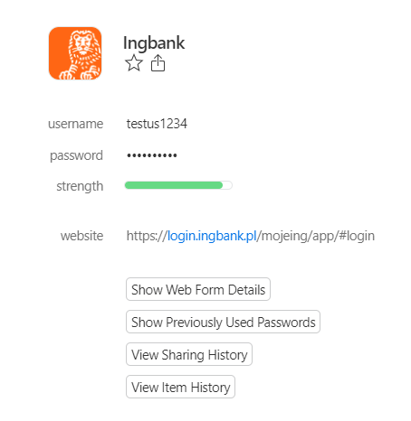

# ING PL + 1Password autofill helper (only PL)
## _Google chrome extensions_

## _Add the missing auto-complete functionality of the masked bank password by combining the 1Password auto-complete functionality with the ING bank login page in to Your chrome browser_

____
__Make sure Your 1Password has added proper ING Bank login credentials with autocomplete functionality__

To use addon, use autofill functionality of 1password to fill username. Next, on password form press keys combination `CTRL`+`SHIFT`+`5` and take advantage of the significant facilitation. 

